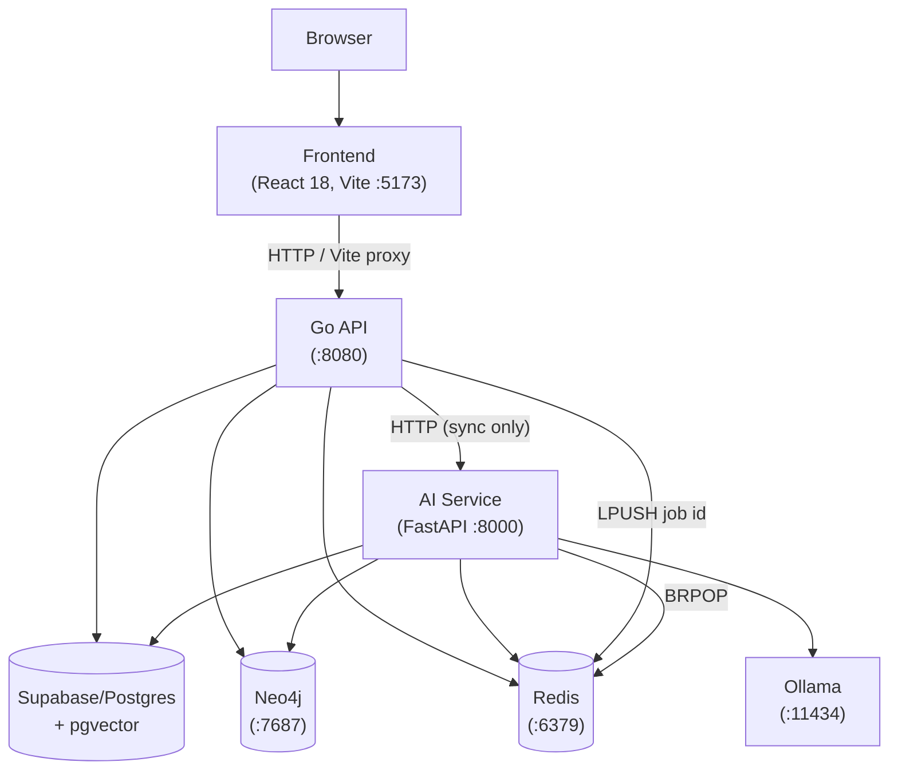

# EduGraph AI — Architecture Overview

**Date:** 2026-08-15  
**Reality check:** This describes what *actually runs* in the local-dev Docker Compose stack. Kong, Kubernetes, Vault, MFA, and Istio from `edugraph-architecture.docx` do NOT exist in this repo.

---

## 1. System Overview

```
┌─────────────────────────────────────────────────────────────────────┐
│  Local Docker Compose                                               │
│                                                                     │
│  ┌──────────────┐    ┌──────────────┐    ┌──────────────────────┐  │
│  │  Frontend    │    │  Go API      │    │  AI Service          │  │
│  │  React 18    │───▶│  :8080       │───▶│  FastAPI :8000       │  │
│  │  Vite :5173  │    │  chi router  │    │  8 asyncio workers   │  │
│  └──────────────┘    └──────┬───────┘    └──────┬───────────────┘  │
│                             │                   │                  │
│                    ┌────────┼───────────────────┼─────────┐        │
│                    │        │      Local         │         │        │
│                    ▼        ▼                   ▼         ▼        │
│               ┌────────┐ ┌──────┐         ┌────────┐ ┌────────┐   │
│               │ Neo4j  │ │Redis │         │ Ollama │ │Jaeger/ │   │
│               │ :7687  │ │:6379 │         │:11434  │ │Grafana │   │
│               └────────┘ └──────┘         └────────┘ └────────┘   │
└─────────────────────────────────────────────────────────────────────┘
                             │
                             ▼
                    ┌─────────────────┐
                    │  Supabase       │
                    │  (hosted PG)    │
                    │  + pgvector     │
                    └─────────────────┘
```

**What runs in Docker Compose** (no `--profile` needed):
- `frontend` — React/Vite dev server :5173
- `api` — Go monolith :8080
- `ai-service` — Python FastAPI :8000
- `neo4j` — local graph DB :7687
- `redis` — job queue + token store :6379
- `ollama`, `jaeger`, `prometheus`, `grafana` — present but not load-bearing

**External** (not in Compose):
- **Supabase** — hosted Postgres with pgvector; configured via `.env`
- **Gemini API** — used by gap-analysis LLM narrative and tutor (optional; 503 if absent)

**Local-DB fallback** (offline dev):
```bash
docker compose --profile local-db up -d postgres flyway
# Then set in .env:
# POSTGRES_HOST=postgres
# POSTGRES_USER=edugraph
# POSTGRES_SSLMODE=disable
```

---

## 2. Service Architecture



---

## 3. Go Backend

**Language:** Go 1.22+  
**Router:** chi v5  
**DI:** manual (no framework)  
**Entry point:** `backend/cmd/api/main.go`

### Domain layout

```
backend/internal/
  auth/       {handler, service, repository, dto}
  curriculum/ {handler, service, repository, dto}
  assessment/ {handler, service, repository, dto}
  student/    {handler, service, repository, dto}
  teacher/    {handler, service, repository, dto}
  school/     {handler, service, repository, dto}
  region/     {handler, service, repository, dto}
  ministry/   {handler, service, repository, dto}
  modeling/   {handler, service, repository, dto}  ← EG-GCKT
  career/     {handler, service, repository, dto}  ← broken
  sync/       {handler, service, repository, dto}
  notification/ ...
  jobs/       ...
  storage/    ...
backend/pkg/
  config/     env-based config struct
  middleware/ JWT auth, role checks, CORS, logging, recover
  storage/    StorageProvider interface + PostgresStorage impl
  ai/         HTTP client to ai-service (TutorAsk works; MatchCareers 404s)
  crypto/     RS256 keypair management
  errors/     typed error responses
```

### Middleware chain

```
Recover → Logging → CORS → [Authenticate → RequireRole] → Handler
```

- `Authenticate` — validates RS256 JWT, injects claims into context
- `RequireRole` — checks `claims.Role` against allowed roles; returns 403 otherwise
- No per-row Postgres RLS — role enforcement is entirely in Go middleware and service layer

---

## 4. AI Service

**Language:** Python 3.12  
**Framework:** FastAPI  
**Workers:** NOT Celery — 8 plain `asyncio` background tasks started as FastAPI lifespan tasks

### Why not Celery

The Go side does a raw `LPUSH` of a job-id string; Celery expects a protocol-wrapped message. Incompatible. See `ADR-002`.

### Worker inventory

| Worker | Trigger | Queue |
|---|---|---|
| `curriculum_worker` | BRPOP | `queue:curriculum:parse` |
| `exam_worker` | BRPOP | `queue:exam:parse` |
| `answer_key_worker` | BRPOP | `queue:exam:answerkey` |
| `gap_worker` | BRPOP | `queue:gap:analyze` |
| `study_plan_worker` | BRPOP | `queue:studyplan:generate` |
| `kt_worker` | BRPOP | `queue:gckt:trace` |
| `embed_worker` | BRPOP | `queue:embedding:generate` |
| `refit_worker` | asyncio time loop (nightly) | — |

### HTTP routes (ai-service)

Only **one** real HTTP route: `POST /api/v1/tutor/ask`.  
Everything else is queue-driven. The `career`, `policy`, `plan`, `exam`, and `gap` route files are 0-line stubs.

### EG-GCKT pipeline

```
exam_submit (Go)
  └─ LPUSH queue:gckt:trace + queue:gap:analyze
       └─ kt_worker.py (BRPOP)
            ├─ BKT update per answer  → evidence_log (provenance='bkt')
            ├─ DINA update per attempt → evidence_log (provenance='dina')
            ├─ IRT theta estimate     → evidence_log (provenance='irt')
            ├─ produce_graph_evidence → evidence_log (provenance='graph_reasoning')
            └─ fuse_skill_state()
                 └─ GCSF weighted fusion → students.skill_states
```

---

## 5. Storage

### File storage (dual-adapter pattern)

```go
type StorageProvider interface {
    Upload(ctx, fileName, mimeType string, file io.Reader) (ref string, error)
    Download(ctx, ref string) (io.ReadCloser, error)
}
```

**Dev:** `PostgresStorage` — stores file bytes in `app_storage.local_files` (BYTEA), returns row UUID as ref. The column `curriculum.upload_jobs.file_s3_key` holds this UUID (legacy name from an S3-first design).

**Prod:** No `S3StorageProvider` exists yet. Swapping to S3 is a one-file addition without handler/service changes.

### Vector embeddings

pgvector is used for `embeddings.clo_embeddings` and `embeddings.topic_embeddings` (HNSW cosine indexes). Written on every curriculum approval. **Semantically meaningless today** — `StubEmbeddingProvider` returns a deterministic hash-based 768-dim vector. A real model (Gemini embeddings API vs. local Ollama) is undecided. See `ADR-008`.

---

## 6. Neo4j Graph

### Node/relationship types

```cypher
(:Subject)-[:HAS_UNIT]->(:Unit)
(:Unit)-[:HAS_TOPIC]->(:Topic)
(:Topic)-[:HAS_SUBTOPIC]->(:Topic)
(:Topic)-[:HAS_PREREQUISITE {edgeType, confidence, weight}]->(:Topic)
(:Topic)-[:HAS_CLO]->(:CLO)
(:School)-[:ENROLLS]->(:Student)
(:Student)-[:STRUGGLED_WITH {severity, isRootCause}]->(:Topic)
(:Teacher)-[:TEACHES_AT]->(:School)
```

### Mirror strategy

- Curriculum approved → `syncCurriculumGraph` (Go, in-process, best-effort after Postgres transaction)
- Prerequisites added → best-effort per-request sync; `neo4j_written` flag; resync endpoint for failures
- Student struggled-with → outbox-poller `sync_worker` mirrors `gap_records` periodically
- Skill states → `(:Student)-[:HAS_SKILL_STATE]->(:Topic)` via `fusion.sync_skill_state()`

### School-Box offline sync

Sync tables have `sync.outbox` triggers. A School-Box device POSTs compressed deltas to `/api/v1/sync/push`; the cloud pulls via `/api/v1/sync/pull`. Device authentication uses a shared device secret (not a JWT — School Boxes are headless).

---

## 7. Redis

| Use | Key pattern | TTL |
|---|---|---|
| Job queue: curriculum parse | `queue:curriculum:parse` (list) | — |
| Job queue: exam parse | `queue:exam:parse` (list) | — |
| Job queue: answer key | `queue:exam:answerkey` (list) | — |
| Job queue: gap analysis | `queue:gap:analyze` (list) | — |
| Job queue: study plan | `queue:studyplan:generate` (list) | — |
| Job queue: GCKT trace | `queue:gckt:trace` (list) | — |
| Job queue: embeddings | `queue:embedding:generate` (list) | — |
| Refresh tokens | `refresh:{tokenHash}` (string) | 7 days |
| School quality cache | `school_quality:{schoolId}` (string/JSON) | 1 h |

All queues use plain `LPUSH` (producer) / `BRPOP` (consumer). No Celery protocol.

---

## 8. Authentication

- **Algorithm:** RS256 JWT
- **Access token TTL:** 15 minutes
- **Refresh token TTL:** 7 days, single-use, rotated on `/auth/refresh`
- **Dev keypair:** auto-generated by `crypto.EnsureDevKeyPair` when `APP_ENV=development`; never committed
- **School-Box devices:** device-secret auth (not JWT), see `internal/sync/handler/device_auth.go`

---

## 9. Frontend

**Stack:** React 18 + TypeScript + Vite + TanStack Router/Query + Zustand + Tailwind + Radix UI

**Role-based routing:**

```tsx
// frontend/src/app/router.tsx
<Route path="/" component={DashboardRouter} />
// DashboardRouter reads authStore.user.role and redirects:
//   student         → /student
//   teacher         → /teacher
//   school_admin    → /school
//   regional_admin  → /regional
//   ministry_admin  → /ministry
//   curriculum_officer → /curriculum
```

**API proxy:** The Vite dev server proxies `/api` to `http://localhost:8080` so the frontend always reaches the Go API regardless of whether it's running via `npm run dev` or inside Docker Compose.

**Pre-commit checks (must pass):**
```bash
npm run type-check
npm run lint
npm run build
```

---

## 10. Supabase Migration Notes

Postgres moved from local Docker to a hosted Supabase project on 2026-08-10. Key differences from a standard self-hosted Postgres:

| Issue | Solution |
|---|---|
| Direct connect is IPv6-only, unreachable on most networks | Use session pooler: `aws-0-<region>.pooler.supabase.com:5432` |
| Session pooler requires `postgres.<ref>` username format | `POSTGRES_USER=postgres.<project-ref>` |
| Supabase passwords contain `@`/`?`/`&` | Credentials are percent-encoded in DSN construction |
| Supabase owns the `storage` schema (its own Storage product) | Our file store uses `app_storage.local_files` instead |
| Supabase requires TLS | `POSTGRES_SSLMODE=require` |
| Shared connection budget | `POSTGRES_MAX_CONNS=15` (down from 80 for local) |

See `ADR-003` for full rationale.
