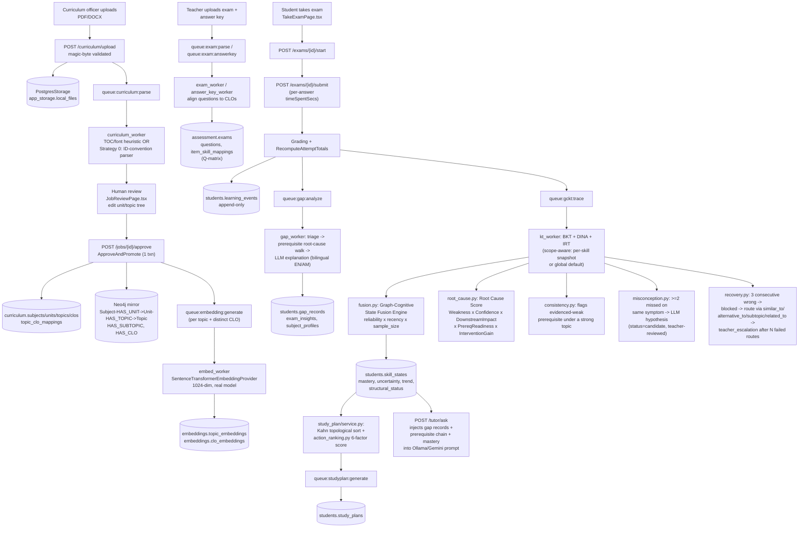
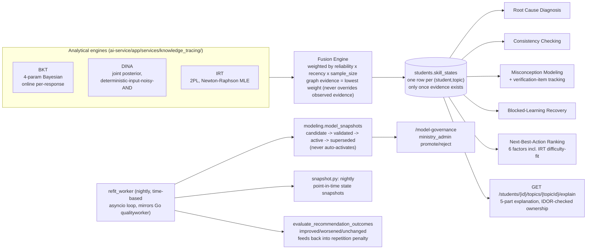

# EduGraph AI — Progress Until Now

Living snapshot of the codebase's architecture and implementation status as of **2026-08-19**. This is a point-in-time record, not a spec — when it drifts from the code, trust the code (see `CLAUDE.md` for the maintained, authoritative version of this same information plus day-to-day development rules).

EduGraph AI is a curriculum-intelligence platform for Ethiopian K-12 education. What runs today is a local-dev Docker Compose stack for every service except Postgres (hosted on Supabase since 2026-08-10). This document covers: the system architecture, the curriculum→exam→gap-analysis→knowledge-tracing pipeline, what's fully built vs. stubbed, the real dataset now seeded into the live database, and the known gaps.

---

## 1. System Architecture

```mermaid
flowchart LR
    subgraph Client
        FE["frontend (React 18 + TS + Vite)\nport 5173\nRole dashboards: student/teacher/school_admin/regional_admin/ministry_admin/curriculum_officer"]
    end

    subgraph Go["api (Go 1.22+, chi router, manual DI)\nport 8080"]
        AUTH[auth: RS256 JWT]
        CURR[curriculum domain]
        ASSESS[assessment domain]
        CAREER["career domain (broken, see gaps)"]
        MODEL[modeling domain: EG-GCKT governance/explain]
        NOTIF[notification domain]
        QW["qualityworker (nightly goroutine)"]
    end

    subgraph Py["ai-service (Python 3.12 FastAPI)\nport 8000\n8 background workers + 1 HTTP route"]
        CW[curriculum_worker]
        EW[exam_worker / answer_key_worker]
        GW[gap_worker]
        SPW[study_plan_worker]
        EMW[embed_worker]
        KTW[kt_worker]
        RFW["refit_worker (time-based, not queue)"]
        TUT["/api/v1/tutor/ask (only live HTTP route)"]
    end

    PG[("Postgres\n(hosted Supabase,\nsession pooler)")]
    NEO[("Neo4j\ncurriculum + progress graph")]
    REDIS[("Redis\n6 job queues, no persistence")]
    OLLAMA["Ollama\nqwen2.5:7b-instruct-q4_K_M\n(local LLM, load-bearing)"]
    GEMINI["Gemini API\n(fallback LLM)"]

    FE -- "REST, JWT cookies" --> Go
    Go -- "LPUSH job" --> REDIS
    REDIS -- "BRPOP" --> Py
    Go -- "HTTP (tutor only resolves)" --> Py
    Go <--> PG
    Py <--> PG
    Go -- "best-effort MERGE mirror" --> NEO
    Go -- "read (graph viz, heatmap)" --> NEO
    Py -- "LLMProvider adapter\nlocal-first, cloud fallback" --> OLLAMA
    Py -.fallback if unreachable.-> GEMINI
```

**Design pattern used throughout**: dual-provider adapters so local dev never hard-depends on a cloud account —
`StorageProvider` (Postgres BYTEA today, S3 later), `EmbeddingProvider` (real `SentenceTransformerEmbeddingProvider` today, `StubEmbeddingProvider` for tests), `LLMProvider` (Ollama primary, Gemini fallback via `generate_with_fallback`).

---

## 2. The Curriculum → Exam → Learning pipeline

---

## 3. EG-GCKT — Graph-Cognitive Knowledge Tracing (built 2026-08-15, exercised end-to-end 2026-08-18/19)

12-milestone implementation of a 24-section research-grade learner-modeling spec. All engines run on honest population-default/CTT-proxy parameters until enough real evidence accumulates per skill/item (30-observation refit threshold).

**Deliberately not built**: DKT, true MIRT calibration — spec's own Phase 6 criterion is "where justified by data," and even after this session's real-data pass (829 real attempts) volume is still below that bar. `model_snapshots.model_type` reserves the enum values for later.

---

## 4. What's Fully Built and Verified

| Area | Status | Verified how |
|---|---|---|
| Curriculum upload → parse → review → approve → Neo4j mirror | ✅ Live | Playwright, real Biology G7-12 dataset (554 topics, 806 CLOs, 90 prerequisite edges) |
| Exam upload/parse/grade, answer-key alignment | ✅ Live | Real HTTP flow, 50 real exams seeded 2026-08-18/19 |
| Prerequisite graph (typed edges, validated/inferred, Neo4j resync) | ✅ Live | Playwright against real BIO-G9 data |
| Gap Analysis 3-pass pipeline | ✅ Live | Real graded attempts, real LLM explanations (Ollama) |
| Study Plan Generator (Kahn + root-cause ordering + 6-factor ranking) | ✅ Live | Generated for a real student sample via `POST /students/me/study-plans` |
| Graph-RAG AI Tutor | ✅ Live (server-proven) | Matched Go structured logs: `status=200, duration=138.58s, model=qwen2.5:7b-instruct-q4_K_M` for real students; browser delivery occasionally flaky under heavy load (see §6) |
| Class-Wide Gap Heatmap | ✅ Live | Neo4j `STRUGGLED_WITH` mirror confirmed populated by real attempts |
| Exam Quality (discrimination, calibration, timing anomalies) | ✅ Live | Recomputed on every read |
| School Quality Score | ✅ Live | Nightly Go goroutine, Redis-cached |
| Role dashboards (all 6 roles) | ✅ Live | Built 2026-07-20/22 |
| CLO/Topic vector embeddings | ✅ Live, real model | `intfloat/multilingual-e5-large`, 1024-dim, backfilled for all 554 topics + 806 CLOs (2026-08-19, migration V060 — was previously a 768-dim stub) |
| Curriculum versioning (supersede/lineage) | ✅ Live | `/curriculum/subjects/{code}/versions` |
| Neo4j graph visualization | ✅ Live | Playwright against real BIO-G9 data, node/edge counts matched at every toggle state |
| EG-GCKT (BKT/DINA/IRT/fusion/root-cause/consistency/misconception/recovery/next-best-action/governance/explainability) | ✅ Live, exercised end-to-end | 829 real exam attempts processed through the real pipeline, 2026-08-18/19; a real production bug (`fusion.py` Decimal/float crash) was found and fixed only because real evidence finally flowed through it |
| Real Biology G7-12 national dataset | ✅ Seeded | 277 students, 3 schools, 50 real exams (real MoE-style Test/Midterm/Final content), 829 attempts, ~19,430 graded answers, 276/277 students with full 3-tier coverage |

---

## 5. What's Stubbed / Broken / Deliberately Deferred

| Area | Status | Why |
|---|---|---|
| **Career matching** | ❌ Broken end-to-end | `ai-service/app/main.py` never registers `career.py`'s router; `career_matcher/service.py` is a 0-line stub. `POST /students/{id}/career/generate` 404s today. |
| `app/api/v1/routes/{policy,plan}.py`, `services/{policy_insight,gap_engine,study_planner,career_matcher}/service.py`, `workers/report_worker.py` | ❌ 0-line stubs | Never started; `gap_engine`/`study_planner` are dead duplicates of the real `gap_analysis`/`study_plan` — don't confuse when searching |
| `embeddings.question_embeddings`, `careers.embedding`, `curriculum.clos.embedding` | ⚠️ Provisioned, unused | Embedding substrate is now real (§4) but nothing writes to these three columns/tables yet |
| DKT, true MIRT calibration | 🔸 Deliberately deferred | Spec's own criterion: "where justified by data." 829 real attempts is still below that bar. |
| CLO Neo4j sync beyond current mirror | 🔸 Deferred to Phase 2 (documented, unchanged since 2026-07-20) | Matches original phase ordering |
| EG-GCKT Explain page UI linking | ⚠️ Reachable only by direct URL | Not click-through from heatmap/exam-insight pages yet |
| `ApproveAndPromote` bulk-upsert batching | ⚠️ Not done | Sequential per-row upserts are slow over the Supabase pooler (~200s for a full grade); Vite proxy timeout raised to 220s (2026-08-19) mitigates the *symptom* (false 500s), not the root cause |

---

## 6. Known Infrastructure Gaps (real, found running the full stack under load)

- **Redis has no persistence (AOF/RDB) configured.** A container restart silently drops every queued-but-unprocessed job across all 6 queues. Confirmed happening more than once during the 2026-08-19 simulation; recovered manually by re-deriving pending work from Postgres. Not fixed in code — flagged as a real gap.
- **This Windows/Docker Desktop environment cannot sustain the full stack** (Supabase pooler + Neo4j + Ollama + 1024-dim embedding model + up to 6 concurrent DB/LLM-heavy workers) under sustained heavy load without occasional Docker daemon 500s, in-container DNS failures, and Neo4j healthcheck timeouts. Not a code defect.
- **AI tutor browser delivery** can still occasionally fail to reach the browser under heavy concurrent load even after the Vite proxy timeout fix — the server-side pipeline itself is proven correct via matched structured logs; the residual failures are container-to-container TCP resets specific to this host, not the tutor logic.
- **Supabase session pooler has a hard ~17-connection budget** (`POSTGRES_MAX_CONNS=15`). Any one-off script sharing the environment with the running `ai-service` process must use one shared, sized `asyncpg` pool at low concurrency (2-3) — opening a second unbounded pool reliably produces `EMAXCONNSESSION` errors.

---

## 7. Bugs found and fixed this session (2026-08-18/19)

1. **`fusion.py` Decimal/float crash** — `evidence_log.reliability` is Postgres `NUMERIC` → `asyncpg` returns `decimal.Decimal`, but `_source_weight()` multiplied it against a plain `float`. This had silently crashed *every* fusion call since EG-GCKT was built (2026-08-15); never caught because no real evidence had flowed through it until this session's real-data pass.
2. **Embedding dimension mismatch** — `embeddings.{topic,clo,question}_embeddings` were `vector(768)`, but the real configured model (`intfloat/multilingual-e5-large`) is 1024-dim. Fixed via migration V060 (drop indexes → truncate → alter column type → recreate indexes), then backfilled real embeddings for all 554 topics + 806 CLOs.
3. **Go↔ai-service timeout mismatch** — Go's HTTP client to ai-service timed out at 60s, shorter than ai-service's own 90s internal Ollama timeout, so Go abandoned legitimately-in-progress AI tutor requests. Raised both with proper headroom (Go → 210s, `OLLAMA_TIMEOUT_SECONDS` → 150s).
4. **Vite dev-proxy false 500s** — no `timeout`/`proxyTimeout` on the `/api` proxy meant any request slower than Vite's internal default got a synthetic `text/plain` 500 from Vite itself while the real backend request kept running and succeeded moments later. Same bug class already documented for `ApproveAndPromote`; now also confirmed for the AI tutor. Fixed: both set to 220s.
5. **Single-consumer worker bottleneck** — `kt_worker.py`/`gap_worker.py` were single `BRPOP` loops, insufficient for real seeded volume. Added opt-in concurrency (`KT_WORKER_CONCURRENCY`/`GAP_WORKER_CONCURRENCY`, default 1, safe/backward-compatible) sharing one sized `asyncpg` pool.
6. **Credentials file usability** — early versions of `EduGraph_All_Credentials.md` used a markdown table; copy-paste on a dotted local-part email (`biology.tigist@...`) silently truncated to `tigist@...` in some editors (double-click treats `.` as a word boundary). Reformatted so every email/password sits alone in its own fenced code block.

---

## 8. Real Dataset Snapshot (live in Supabase as of 2026-08-19)

- **3 schools**: AASTU Demonstration School (Addis Ababa, urban), Bahir Dar General Secondary School (Amhara, semi-urban), Gode Rural High School (Somali, rural, grades 7-10 only — no preparatory program)
- **277 students** across grades 7-12, 291 total accounts including staff
- **12 named performance profiles** per exam tier (high_performer, struggling, improving, declining, conceptual_gap, strong_prereq_low_overall, inconsistent, memorization, prerequisite_gap, recovery, random_uncertain, misconception), each with exact target score bands, not free-random simulation
- **50 real exams**, sourced from real Ethiopian MoE-style Biology G7-12 exam documents (Test/Midterm/Final, cumulative content), content-matched to real `topic_id`/`clo_code`
- **829 real exam attempts**, **~19,430 graded answers**, **276/277 students** with complete Test+Midterm+Final coverage (the one exception is a throwaway lifecycle-test account)
- Two password buckets: `password123` (original + first-pass accounts), `EduGraphDemo!2026` (new-pass, `STU-`-coded accounts)
- Full credential list: `EduGraph AI/EduGraph_All_Credentials.md`
- Full narrative reports: `EduGraph AI/EduGraph_RealData_Simulation_Report.docx`, `EduGraph_Biology_Pilot_Scenario_and_QA_Report.docx`, `EduGraph_Credential_Report.docx`

---

## 9. Reference

See `CLAUDE.md` (repo root) for the maintained, day-to-day version of this document — service list, database schema detail, development rules, and critical design decisions. This file is a point-in-time architectural snapshot generated alongside that update; `CLAUDE.md` is the one to keep reading going forward.
